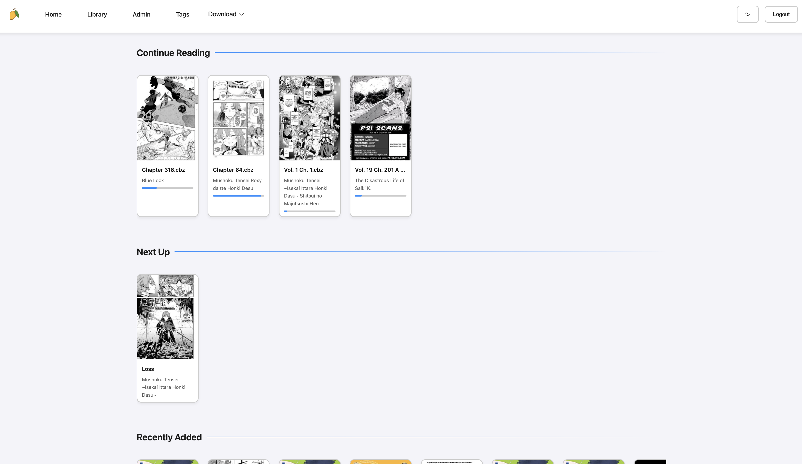
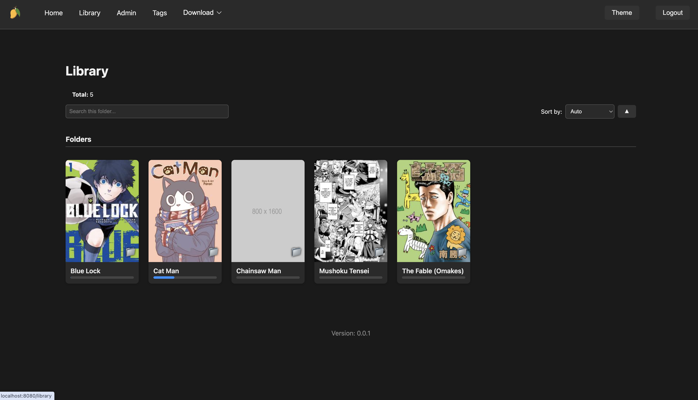
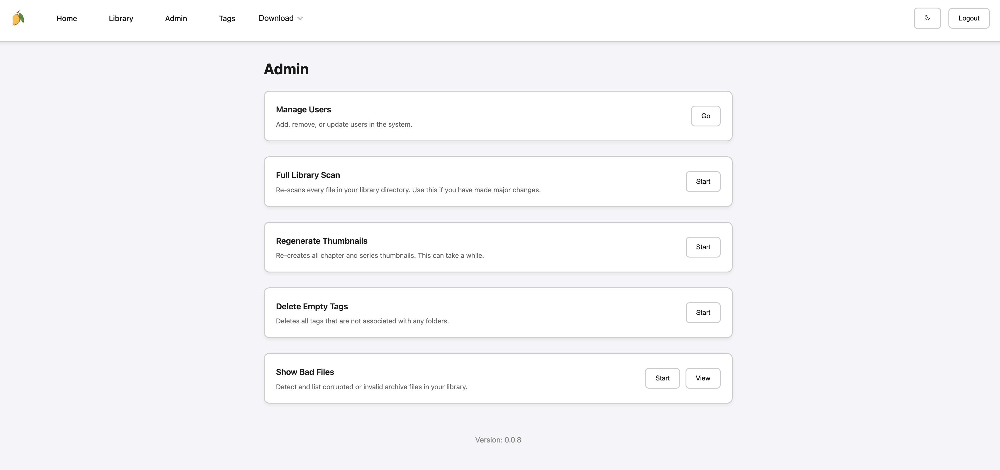
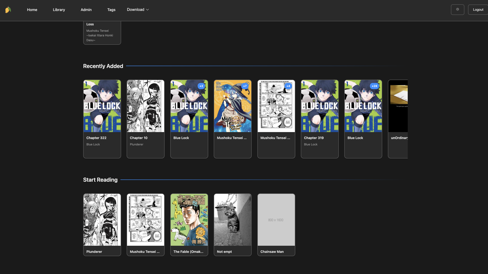

# Mango-Go

A self-hosted manga server and web reader written in Go. This is a modern rewrite of the original [Mango](https://github.com/vrsandeep/Mango/) project, offering improved performance, easier deployment, and better maintainability.

[](https://github.com/vrsandeep/mango-go/actions/workflows/test.yml)

## ✨ Features

- 📚 **Manga Library Management**: Organize and browse your manga collection
- 🌐 **Web Reader**: Read manga directly in your browser
- 📱 **Responsive Design**: Works on desktop, tablet, and mobile devices
- 📥 **Download Manager**: Download manga from various sources
- 🏷️ **Tagging System**: Organize manga with custom tags and folders
- 👥 **Multi-User Support**: User management with different permission levels
- 🔄 **Subscriptions**: Track and download new chapters automatically
- 📊 **Progress Tracking**: Keep track of your reading progress


## Screenshots






## 🚀 Installation & Usage

There are two primary ways to run Mango-Go: via Docker (recommended for production) or as a standalone binary.

### 🐳 Option 1: Docker

The recommended way to run Mango-Go in production is using Docker and Docker Compose.

#### Quick Start

1. ⚙️ **docker-compose:**
   ```yaml
   services:
      mango:
         image: ghcr.io/vrsandeep/mango-go
         container_name: mango
         restart: unless-stopped
         ports:
            - "8080:8080"
         environment:
            - MANGO_DATABASE_PATH=/app/data/mango.db
            - MANGO_LIBRARY_PATH=/manga
            - MANGO_PLUGINS_PATH=/app/plugins
         #user: 1000:1000  # Add this optionally on linux systems
         volumes:
            # This will store the SQLite database
            - ./data:/app/data
            # Mount your actual manga library on your host machine to /manga inside the container.
            - ./manga:/manga # 👈  This is safe. This project does not modify the manga folder.
            # Mount plugins directory to persist installed plugins
            - ./plugins:/app/plugins # This is where plugins will be stored
         healthcheck:
            test: ["CMD", "curl", "-f", "http://localhost:8080/api/health"]
            interval: 30s
            timeout: 10s
            retries: 3
            start_period: 40s
   ```

2. **Start the Application:**
   ```sh
   docker-compose up -d
   ```

3. **First Run (Admin User):**
   The first time you start the application, it will create a default `admin` user. Check the container logs to get the randomly generated password:
   ```sh
   docker-compose logs
   ```
   Look for a message like:
   ```
   Default admin user created.
   Username: admin
   Password: <randomly_generated_password>
   ```

4. **Access Mango-Go:**
   Open your web browser and navigate to `http://localhost:8080`. Log in with the admin credentials and change the password immediately via the Admin > User Management page.

## Option 2: Use binary from release

Go to [Releases](https://github.com/vrsandeep/mango-go/releases) and download a binary of your OS. Follow Configure section from next option.

### Option 3: Build Binary

The application can be compiled into a single, portable binary file that contains all necessary web assets and migrations.

1. **Build the Binary:**
   ```sh
   make build
   ```

2. **Configure:**
   Create a `config.yml` file in the same directory as the binary:
   ```yml
   library:
     path: "/path/to/your/manga"
   database:
     path: "./mango.db"
   plugins:
     path: "./plugins"  # Path to plugins directory
   port: 8080
   scan_interval: 30
   ```

3. **Run the Application:**
   ```sh
   ./mango-go
   ```
   The application will start at `http://localhost:8080`.

## Library Organization

While Mango-Go can work with any folder structure, it's recommended to organize your manga library with series at the root level:

```
manga/
├── One Piece/
│   ├── Volume 1/
│   │   ├── Chapter 1.cbr
│   │   └── Chapter 2.cbr
│   └── Volume 2/
│       └── Chapter 3.cbr
├── Naruto/
│   ├── Volume 1.cbz
│   └── Volume 2.cbz
└── Dragon Ball/
    └── Chapter 1.zip
```

### Supported Formats

- **Comic Book Archives**: `.cbz`, `.cbr`, `.cb7`
- **Compressed Archives**: `.zip`, `.rar`, `.7z`

## Configuration

### Environment Variables

You can configure Mango-Go using environment variables:

| Variable | Description | Default |
|----------|-------------|---------|
| `MANGO_LIBRARY_PATH` | Path to manga library | `./manga` |
| `MANGO_DATABASE_PATH` | SQLite database path | `./mango.db` |
| `MANGO_PLUGINS_PATH` | Path to plugins directory | `../mango-go-plugins` |
| `MANGO_PORT` | Web server port | `8080` |
| `MANGO_SCAN_INTERVAL` | Library scan interval (minutes) | `30` |

## Data Persistence

When using Docker, the `docker-compose.yml` file is configured to store all application data in a `./data` directory on your host machine. Your manga library is mounted directly into the container and is never modified, ensuring your data is safe even if you update or restart the container.

### Plugin Storage

Plugins installed via the Plugin Repositories interface are stored in the `./plugins` directory (mounted to `/app/plugins` inside the container). This ensures that:
- Installed plugins persist across container restarts
- Plugin updates and installations are saved to your host machine
- You can manually manage plugins by adding/removing directories in the `./plugins` folder

**Note**: The plugins directory will be created automatically if it doesn't exist. Make sure the directory has proper write permissions for the container user.


## Troubleshooting

### Common Issues

1. **Library Not Scanning**: Check file permissions and ensure the manga directory is accessible
2. **Database Errors**: Verify SQLite is properly installed and the database directory is writable
3. **Port Already in Use**: Change the port in your configuration

### Logs

Check application logs for detailed error information:

```sh
# Docker
docker-compose logs

# Standalone
./mango-go 2>&1 | tee mango.log
```

## Support

- 🐞 **Issues**: Report bugs and request features on [GitHub Issues](https://github.com/vrsandeep/mango-go/issues)
- ✨ **Documentation**: For contribution guidelines, see [CONTRIBUTING.md](CONTRIBUTING.md)


## Acknowledgments

- Original [Mango](https://github.com/hkalexling/mango/) project for inspiration
